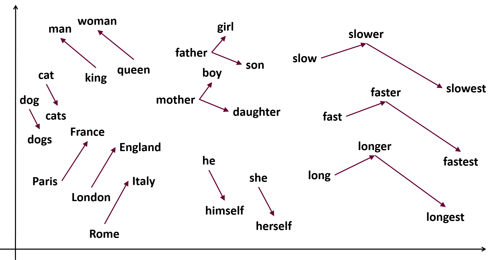
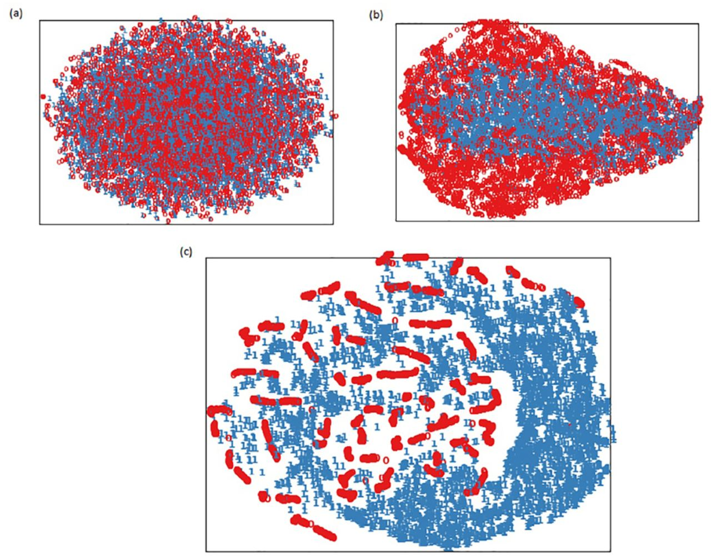

data_preprocessing.py
=====================

``data_preprocessing.py`` is used to preprocess data, including generating ``png`` files and ``npz`` files. 

The main function of ``data_preprocessing.py`` is ``void data_prep(gen_name)``, which is divided into two parts:

- the first part is to generate ``png``

- the second part is to generate ``npz``

This article will introduce the data preprocessing process.

png generation part
+++++++++++++++++++

- ``mkdir(Generated file path)``

	First generate the file path, create the folder, and then put the data into the corresponding folder, otherwise python will report an error.

- ``read_data(Read ACTGN data)``

	Read all the data from the ``txt`` file, and convert ``ACGTN`` to the corresponding number to facilitate ``one-hot encoding``.

	.. note::

	   It can only recognize ``ACGTN`` data and is ``case sensitive``.
	   
- ``cut``

	Cut the ``positive`` and ``negative`` into the ``same size``.
	
	Because the data needs to be connected together later, it must be the same size to run.
	   	   
- ``data shuffle(use: np.random.choice)``

	The data ``must be shuffled``, because similar data are all together. Otherwise, the model cannot be trained, and the accuracy rate will always hover around 0.5.

- ``data_split``

	The data will be divided into ``training set`` and ``testing set``, the split ratio is ``0.9:0.1``, and then the training set will continue to be split into ``0.89:0.11`` in ``train.py``, that is to say, ``training set: validation set: testing set=0.8 : 0.1: 0.1``

- ``to_categorical``

	from keras.utils import to_categorical, keras provides a very convenient and easy-to-use function to_categorical, which can be used to perform fast one-hot encoding with high efficiency and fast speed. So the one-hot encoding here is to use the function provided by keras.

- ``Generate png``

	There is a bit of confusion here, because if all the data is one-hot-encoded and then png is generated at one time, the system will be stuck, no results will be given for a long time, and a lot of memory will be used, so something special is needed here. Processing.
	
	Because the test set is relatively small, the test set can be generated all at once.

	The training set is very large, so the training set is divided into small pieces of ``1000``, and each piece of data is processed and the background garbage collection mechanism operates to release the memory, so that it will not cause the problem of memory leaks.
	
	Python's garbage collection mechanism is divided into three layers. Different generations of garbage are collected asynchronously. In order to release memory as soon as possible, ``gc.collect()`` is used here to directly collect memory garbage of all generations.

- ``Write to png file(imageio)``

	In the end, we need to write png files, which can be written to png files very easily using the interface provided by imageio. The png files come with compression, so it can save space very much.
	
	
	
.. tip::

	**About the progress bar**
	
	If you are using a ``graphical operating system`` such as ``Ubuntu`` or ``Windows``, and all data is displayed ``directly on the command line``, then you can use the progress bar to display the image generation.

	The method is like this, comment out ``for j in range(len(test_pos)):`` and use ``for j in tqdm.trange( len(test_pos), ascii=True ):``.
	
	There are these codes in data_preprocessing.py, you only need to use `` # `` to comment out the current code and restore the commented out code.

	It takes a lot of time to generate these pictures, so it is necessary for the real-time system using progress bar.
	
	If your python3 has not installed the ``tqdm`` module, use ``pip install tqdm`` to install this module. The Linux environment may require ``sudo`` permissions.
	
	Please note that the file system to which txt belongs cannot display the ``backspace character(\b)``, so if you use a supercomputer to run these codes, ``do not use tqdm``, because this will generate a large number of characters that txt cannot recognize and write quite long useless log data.

npz generation part
+++++++++++++++++++

``word2vec`` proved to be a very good embedding method, which can find the connection between different words and improve the feasibility of NLP.

``DNA2vec`` is an application of word2vec. First cut DNA into ``6mer`` or ``4mer``, and then use embedding method to vectorize DNA.

This method uses ``6mer``, which means that there are a total of ``2**6+1 Vectors`` (the first vector is a 0 vector), and the dimension of each vector is 100, which means that data of ``4097*100`` dimensions will be generated.

- ``Read the data and preprocess it``

	First, the data needs to be read and preprocessed, and then symbols such as ``ACGT`` can be converted into codes for processing.
	
- ``Break Sentences into Words``

	First break the sentence into words so that you can proceed with subsequent processing.

- ``Change Word to Vector``

	Convert tokenized words into Vectors.
	
- ``Save Data``

	Save the ``npz`` file to the corresponding location. End of program.
	
	
	
	
	
