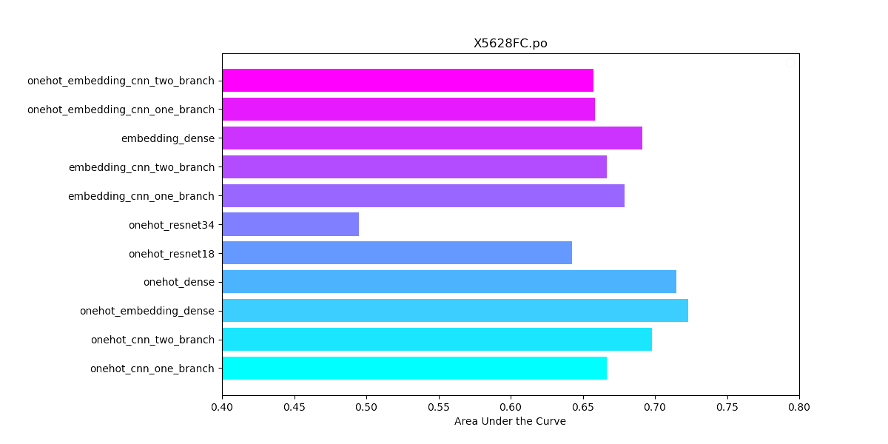

.. DeepChromeHiC documentation master file, created by
   sphinx-quickstart on Fri Jun 18 07:28:56 2021.
   You can adapt this file completely to your liking, but it should at least
   contain the root `toctree` directive.

|

Welcome to DeepChromeHiC's documentation!
=========================================

.. toctree::
	:maxdepth: 2
	:caption: Catalog:
   
	quickstart.rst
	supercomputer.rst
   
	DeepChromeHiC.py.rst
	datastructure.rst
	
	data_preprocessing.py.rst
	
	train.py.rst
	test.py.rst
	model.py.rst
	
	tools.rst
	reStructuredText.rst
	
	
	
	
	
.. image:: img/div.png