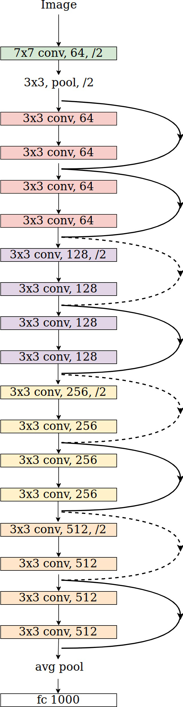

model.py
========

``model.py`` is used to store the model. A total of ``11`` different models are placed here. These models need to be used in ``train.py`` and ``test.py``.

This module will introduce the structure, usage and performance of these models.

.. image:: img/div.png

Module Introduction
+++++++++++++++++++

This release includes multiple models: 

onehot_cnn_one_branch
---------------------

Use one-hot encoding to process the ACGT base fragments of the promoter and enhancer, then merge the promoter and enhancer together, and then use CNN to process, and finally get the output

.. image:: img/model_onehot_cnn_one_branch.png

Single branch cnn model: First, perform one-hot encoding on Sequence in Interaction Region1 and Sequence in Interaction Region2, and then merge the two one-hot encoded data. Use the CNN layer with KERNEL_SIZE = 24, strides = 4, the activation layer and the BatchNormalization layer as a CNN unit, repeat this CNN unit three times, then flatten the data and send it to the dense layer, insert a dropout layer between the two dense layers to prevent the model Over-fitting, and finally output the result (2 values) in the form of one-hot encoding. This model imitates the well-known image processing model VGG16, which has more parameters and can obtain better results.

.. image:: img/onehot_cnn_one_branch.png

``The structure of onehot_cnn_one_branch is shown in the figure above.``

.. code:: bash

	Model: "sequential"
	_________________________________________________________________
	Layer (type)                 Output Shape              Param #   
	=================================================================
	conv2d (Conv2D)              (None, 5001, 5, 64)       1600      
	_________________________________________________________________
	batch_normalization (BatchNo (None, 5001, 5, 64)       256       
	_________________________________________________________________
	activation (Activation)      (None, 5001, 5, 64)       0         
	_________________________________________________________________
	conv2d_1 (Conv2D)            (None, 1251, 5, 64)       98368     
	_________________________________________________________________
	batch_normalization_1 (Batch (None, 1251, 5, 64)       256       
	_________________________________________________________________
	activation_1 (Activation)    (None, 1251, 5, 64)       0         
	_________________________________________________________________
	max_pooling2d (MaxPooling2D) (None, 312, 5, 64)        0         
	_________________________________________________________________
	batch_normalization_2 (Batch (None, 312, 5, 64)        256       
	_________________________________________________________________
	conv2d_2 (Conv2D)            (None, 78, 5, 128)        196736    
	_________________________________________________________________
	batch_normalization_3 (Batch (None, 78, 5, 128)        512       
	_________________________________________________________________
	activation_2 (Activation)    (None, 78, 5, 128)        0         
	_________________________________________________________________
	conv2d_3 (Conv2D)            (None, 20, 5, 128)        393344    
	_________________________________________________________________
	batch_normalization_4 (Batch (None, 20, 5, 128)        512       
	_________________________________________________________________
	activation_3 (Activation)    (None, 20, 5, 128)        0         
	_________________________________________________________________
	max_pooling2d_1 (MaxPooling2 (None, 5, 5, 128)         0         
	_________________________________________________________________
	flatten (Flatten)            (None, 3200)              0         
	_________________________________________________________________
	batch_normalization_5 (Batch (None, 3200)              12800     
	_________________________________________________________________
	dense (Dense)                (None, 2048)              6555648   
	_________________________________________________________________
	dropout (Dropout)            (None, 2048)              0         
	_________________________________________________________________
	dense_1 (Dense)              (None, 2048)              4196352   
	_________________________________________________________________
	dropout_1 (Dropout)          (None, 2048)              0         
	_________________________________________________________________
	dense_2 (Dense)              (None, 1000)              2049000   
	_________________________________________________________________
	dense_3 (Dense)              (None, 2)                 2002      
	=================================================================
	Total params: 13,507,642
	Trainable params: 13,500,346
	Non-trainable params: 7,296

``The above is the model parameters and size information of onehot_cnn_one_branch.``

.. image:: img/div.png

onehot_cnn_two_branch
---------------------

Use one-hot encoding to process the ACGT base fragments of the promoter and enhancer, and then send the promoter and enhancer to different CNN networks, and then merge the CNN networks to finally get the output

Two-branch cnn model: First, perform one-hot encoding on Sequence in Interaction Region1 and Sequence in Interaction Region2 respectively, and then send them to different CNN units. Use the CNN layer with KERNEL_SIZE = 24, strides = 4, the activation layer and the BatchNormalization layer as a CNN unit, repeat this CNN unit three times, then merge the Sequence in Interaction Region1 branch and Sequence in Interaction Region2 branch of the CNN unit and flatten the data and Send it to the dense layer, insert a dropout layer between the two dense layers to prevent the model from overfitting, and finally output the result (2 values) in the form of one-hot encoding.

``The structure of onehot_cnn_two_branch is shown in the figure above.``

.. code:: bash

	Model: "functional_1"
	__________________________________________________________________________________________________
	Layer (type)                    Output Shape         Param #     Connected to                     
	==================================================================================================
	input_1 (InputLayer)            [(None, 10001, 5, 1) 0                                            
	__________________________________________________________________________________________________
	input_2 (InputLayer)            [(None, 10001, 5, 1) 0                                            
	__________________________________________________________________________________________________
	conv2d (Conv2D)                 (None, 2501, 5, 64)  1600        input_1[0][0]                    
	__________________________________________________________________________________________________
	conv2d_6 (Conv2D)               (None, 2501, 5, 64)  1600        input_2[0][0]                    
	__________________________________________________________________________________________________
	conv2d_1 (Conv2D)               (None, 626, 5, 64)   98368       conv2d[0][0]                     
	__________________________________________________________________________________________________
	conv2d_7 (Conv2D)               (None, 626, 5, 64)   98368       conv2d_6[0][0]                   
	__________________________________________________________________________________________________
	conv2d_2 (Conv2D)               (None, 157, 5, 64)   98368       conv2d_1[0][0]                   
	__________________________________________________________________________________________________
	conv2d_8 (Conv2D)               (None, 157, 5, 64)   98368       conv2d_7[0][0]                   
	__________________________________________________________________________________________________
	max_pooling2d (MaxPooling2D)    (None, 78, 5, 64)    0           conv2d_2[0][0]                   
	__________________________________________________________________________________________________
	max_pooling2d_2 (MaxPooling2D)  (None, 78, 5, 64)    0           conv2d_8[0][0]                   
	__________________________________________________________________________________________________
	batch_normalization (BatchNorma (None, 78, 5, 64)    256         max_pooling2d[0][0]              
	__________________________________________________________________________________________________
	batch_normalization_2 (BatchNor (None, 78, 5, 64)    256         max_pooling2d_2[0][0]            
	__________________________________________________________________________________________________
	conv2d_3 (Conv2D)               (None, 20, 5, 128)   196736      batch_normalization[0][0]        
	__________________________________________________________________________________________________
	conv2d_9 (Conv2D)               (None, 20, 5, 128)   196736      batch_normalization_2[0][0]      
	__________________________________________________________________________________________________
	conv2d_4 (Conv2D)               (None, 5, 5, 128)    393344      conv2d_3[0][0]                   
	__________________________________________________________________________________________________
	conv2d_10 (Conv2D)              (None, 5, 5, 128)    393344      conv2d_9[0][0]                   
	__________________________________________________________________________________________________
	conv2d_5 (Conv2D)               (None, 2, 5, 128)    393344      conv2d_4[0][0]                   
	__________________________________________________________________________________________________
	conv2d_11 (Conv2D)              (None, 2, 5, 128)    393344      conv2d_10[0][0]                  
	__________________________________________________________________________________________________
	max_pooling2d_1 (MaxPooling2D)  (None, 1, 5, 128)    0           conv2d_5[0][0]                   
	__________________________________________________________________________________________________
	max_pooling2d_3 (MaxPooling2D)  (None, 1, 5, 128)    0           conv2d_11[0][0]                  
	__________________________________________________________________________________________________
	flatten (Flatten)               (None, 640)          0           max_pooling2d_1[0][0]            
	__________________________________________________________________________________________________
	flatten_1 (Flatten)             (None, 640)          0           max_pooling2d_3[0][0]            
	__________________________________________________________________________________________________
	batch_normalization_1 (BatchNor (None, 640)          2560        flatten[0][0]                    
	__________________________________________________________________________________________________
	batch_normalization_3 (BatchNor (None, 640)          2560        flatten_1[0][0]                  
	__________________________________________________________________________________________________
	dense (Dense)                   (None, 2048)         1312768     batch_normalization_1[0][0]      
	__________________________________________________________________________________________________
	dense_1 (Dense)                 (None, 2048)         1312768     batch_normalization_3[0][0]      
	__________________________________________________________________________________________________
	dropout (Dropout)               (None, 2048)         0           dense[0][0]                      
	__________________________________________________________________________________________________
	dropout_1 (Dropout)             (None, 2048)         0           dense_1[0][0]                    
	__________________________________________________________________________________________________
	concatenate (Concatenate)       (None, 4096)         0           dropout[0][0]                    
																	 dropout_1[0][0]                  
	__________________________________________________________________________________________________
	dense_2 (Dense)                 (None, 2048)         8390656     concatenate[0][0]                
	__________________________________________________________________________________________________
	dropout_2 (Dropout)             (None, 2048)         0           dense_2[0][0]                    
	__________________________________________________________________________________________________
	dense_3 (Dense)                 (None, 1000)         2049000     dropout_2[0][0]                  
	__________________________________________________________________________________________________
	dense_4 (Dense)                 (None, 2)            2002        dense_3[0][0]                    
	==================================================================================================
	Total params: 15,436,346
	Trainable params: 15,433,530
	Non-trainable params: 2,816

``The above is the model parameters and size information of onehot_cnn_two_branch.``

.. image:: img/div.png

onehot_embedding_dense
----------------------

Use one-hot encoding to process the ACGT base fragments of the promoter and enhancer, then merge the promoter and enhancer, then use the embedding layer to embed the gene fragment, and then send it to multiple dense layers and output

One-hot encoding and embedding model: First, perform one-hot encoding on Sequence in Interaction Region1 and Sequence in Interaction Region2 respectively, and then merge the two one-hot encoded data. Then use the 6mer embedding layer for embedding, then flatten the data and send it to the dense layer, insert a dropout layer between the two dense layers to prevent the model from overfitting, and finally output the result (2 values) in the form of one-hot encoding.

.. image:: img/onehot_embedding_dense.png

``The structure of onehot_embedding_dense is shown in the figure above.``

.. code:: bash

	Model: "sequential"
	_________________________________________________________________
	Layer (type)                 Output Shape              Param #   
	=================================================================
	embedding (Embedding)        (None, 20002, 5, 1, 6)    24582     
	_________________________________________________________________
	flatten (Flatten)            (None, 600060)            0         
	_________________________________________________________________
	batch_normalization (BatchNo (None, 600060)            2400240   
	_________________________________________________________________
	dense (Dense)                (None, 512)               307231232 
	_________________________________________________________________
	batch_normalization_1 (Batch (None, 512)               2048      
	_________________________________________________________________
	activation (Activation)      (None, 512)               0         
	_________________________________________________________________
	dropout (Dropout)            (None, 512)               0         
	_________________________________________________________________
	dense_1 (Dense)              (None, 512)               262656    
	_________________________________________________________________
	batch_normalization_2 (Batch (None, 512)               2048      
	_________________________________________________________________
	activation_1 (Activation)    (None, 512)               0         
	_________________________________________________________________
	dropout_1 (Dropout)          (None, 512)               0         
	_________________________________________________________________
	dense_2 (Dense)              (None, 512)               262656    
	_________________________________________________________________
	batch_normalization_3 (Batch (None, 512)               2048      
	_________________________________________________________________
	activation_2 (Activation)    (None, 512)               0         
	_________________________________________________________________
	dense_3 (Dense)              (None, 2)                 1026      
	=================================================================
	Total params: 310,188,536
	Trainable params: 308,985,344
	Non-trainable params: 1,203,192

``The above is the model parameters and size information of onehot_embedding_dense.``

.. image:: img/div.png

onehot_embedding_cnn_one_branch
-------------------------------

Use one-hot encoding to process the ACGT base fragments of the promoter and enhancer, then merge the promoter and enhancer together, then use the embedding layer for embedding and then use CNN to process, and finally get the output

.. image:: img/model_onehot_embedding_cnn_one_branch.png

After using one-hot encoding and embedding, use CNN to process the model: First, perform one-hot encoding on Sequence in Interaction Region1 and Sequence in Interaction Region2 respectively. Then use the 6mer embedding layer for embedding, then merge the two embedding data, and then send it to the CNN unit, use the CNN layer with KERNEL_SIZE = 24, strides = 4, the activation layer and the BatchNormalization layer as a CNN unit, repeat this CNN Unit three times, then enter the flatten layer, then send to the dense layer, the layer size is 2048, 2048, 1000. Insert a dropout layer between the two dense layers to prevent the model from overfitting, and finally output the result (2 values) in the form of one-hot encoding.

.. image:: img/onehot_embedding_cnn_one_branch.png

``The structure of onehot_embedding_cnn_one_branch is shown in the figure above.``

.. code:: bash

	Model: "functional_1"
	__________________________________________________________________________________________________
	Layer (type)                    Output Shape         Param #     Connected to                     
	==================================================================================================
	input_1 (InputLayer)            [(None, 3000)]       0                                            
	__________________________________________________________________________________________________
	input_2 (InputLayer)            [(None, 2000)]       0                                            
	__________________________________________________________________________________________________
	embedding (Embedding)           (None, 3000, 6)      24582       input_1[0][0]                    
	__________________________________________________________________________________________________
	embedding_1 (Embedding)         (None, 2000, 6)      24582       input_2[0][0]                    
	__________________________________________________________________________________________________
	concatenate (Concatenate)       (None, 5000, 6)      0           embedding[0][0]                  
																	 embedding_1[0][0]                
	__________________________________________________________________________________________________
	sequential (Sequential)         (None, 166, 64)      23360       concatenate[0][0]                
	__________________________________________________________________________________________________
	flatten (Flatten)               (None, 10624)        0           sequential[0][0]                 
	__________________________________________________________________________________________________
	batch_normalization_1 (BatchNor (None, 10624)        42496       flatten[0][0]                    
	__________________________________________________________________________________________________
	dropout (Dropout)               (None, 10624)        0           batch_normalization_1[0][0]      
	__________________________________________________________________________________________________
	dense (Dense)                   (None, 512)          5440000     dropout[0][0]                    
	__________________________________________________________________________________________________
	batch_normalization_2 (BatchNor (None, 512)          2048        dense[0][0]                      
	__________________________________________________________________________________________________
	activation_2 (Activation)       (None, 512)          0           batch_normalization_2[0][0]      
	__________________________________________________________________________________________________
	dropout_1 (Dropout)             (None, 512)          0           activation_2[0][0]               
	__________________________________________________________________________________________________
	dense_1 (Dense)                 (None, 512)          262656      dropout_1[0][0]                  
	__________________________________________________________________________________________________
	batch_normalization_3 (BatchNor (None, 512)          2048        dense_1[0][0]                    
	__________________________________________________________________________________________________
	activation_3 (Activation)       (None, 512)          0           batch_normalization_3[0][0]      
	__________________________________________________________________________________________________
	dropout_2 (Dropout)             (None, 512)          0           activation_3[0][0]               
	__________________________________________________________________________________________________
	dense_2 (Dense)                 (None, 1)            513         dropout_2[0][0]                  
	==================================================================================================
	Total params: 5,822,285
	Trainable params: 5,798,861
	Non-trainable params: 23,424

``The above is the model parameters and size information of onehot_embedding_cnn_one_branch.``

.. image:: img/div.png

onehot_embedding_cnn_two_branch
-------------------------------

Use one-hot encoding to process the ACGT base fragments of the promoter and enhancer, and then send the promoter and enhancer to different embedding layers for embedding and then send to different CNN networks, and then merge the CNN networks to finally get the output

.. image:: img/model_onehot_embedding_cnn_two_branch.png

After using one-hot encoding and embedding, use CNN to process the model: First, perform one-hot encoding on Sequence in Interaction Region1 and Sequence in Interaction Region2 respectively. Then use the 6mer embedding layer for embedding, and then send it to the CNN unit, use the CNN layer with KERNEL_SIZE = 24, strides = 4, the activation layer and the BatchNormalization layer as a CNN unit, repeat the CNN unit three times, and then merge the Sequence in Interaction The CNN result of Region1 and the CNN result of Sequence in Interaction Region2. Then enter the flatten layer, and then send to the dense layer, the layer size is 2048, 2048, 1000. Insert a dropout layer between the two dense layers to prevent the model from overfitting, and finally output the result (2 values) in the form of one-hot encoding.

.. image:: img/onehot_embedding_cnn_two_branch.png

``The structure of onehot_embedding_cnn_two_branch is shown in the figure above.``

.. code:: bash

	Model: "functional_1"
	__________________________________________________________________________________________________
	Layer (type)                    Output Shape         Param #     Connected to                     
	==================================================================================================
	input_1 (InputLayer)            [(None, 3000)]       0                                            
	__________________________________________________________________________________________________
	input_2 (InputLayer)            [(None, 2000)]       0                                            
	__________________________________________________________________________________________________
	embedding (Embedding)           (None, 3000, 6)      24582       input_1[0][0]                    
	__________________________________________________________________________________________________
	embedding_1 (Embedding)         (None, 2000, 6)      24582       input_2[0][0]                    
	__________________________________________________________________________________________________
	sequential (Sequential)         (None, 100, 64)      23360       embedding[0][0]                  
	__________________________________________________________________________________________________
	sequential_1 (Sequential)       (None, 100, 64)      15680       embedding_1[0][0]                
	__________________________________________________________________________________________________
	flatten (Flatten)               (None, 6400)         0           sequential[0][0]                 
	__________________________________________________________________________________________________
	flatten_1 (Flatten)             (None, 6400)         0           sequential_1[0][0]               
	__________________________________________________________________________________________________
	concatenate (Concatenate)       (None, 12800)        0           flatten[0][0]                    
																	 flatten_1[0][0]                  
	__________________________________________________________________________________________________
	batch_normalization_2 (BatchNor (None, 12800)        51200       concatenate[0][0]                
	__________________________________________________________________________________________________
	dropout (Dropout)               (None, 12800)        0           batch_normalization_2[0][0]      
	__________________________________________________________________________________________________
	dense (Dense)                   (None, 512)          6554112     dropout[0][0]                    
	__________________________________________________________________________________________________
	batch_normalization_3 (BatchNor (None, 512)          2048        dense[0][0]                      
	__________________________________________________________________________________________________
	activation_2 (Activation)       (None, 512)          0           batch_normalization_3[0][0]      
	__________________________________________________________________________________________________
	dropout_1 (Dropout)             (None, 512)          0           activation_2[0][0]               
	__________________________________________________________________________________________________
	dense_1 (Dense)                 (None, 512)          262656      dropout_1[0][0]                  
	__________________________________________________________________________________________________
	batch_normalization_4 (BatchNor (None, 512)          2048        dense_1[0][0]                    
	__________________________________________________________________________________________________
	activation_3 (Activation)       (None, 512)          0           batch_normalization_4[0][0]      
	__________________________________________________________________________________________________
	dropout_2 (Dropout)             (None, 512)          0           activation_3[0][0]               
	__________________________________________________________________________________________________
	dense_2 (Dense)                 (None, 1)            513         dropout_2[0][0]                  
	==================================================================================================
	Total params: 6,960,781
	Trainable params: 6,932,877
	Non-trainable params: 27,904

``The above is the model parameters and size information of onehot_embedding_cnn_two_branch.``

.. image:: img/div.png

onehot_dense
------------

Use one-hot encoding to process the ACGT base fragments of the promoter and enhancer, then merge the promoter and enhancer, and then send it to multiple dense layers and output

.. image:: img/model_onehot_dense.png

Dense model: First, perform one-hot encoding on Sequence in Interaction Region1 and Sequence in Interaction Region2, and then merge the two one-hot encoded data. Then flatten the data and send it to the dense layer. The dense layer has five layers, which contain 2048, 2048, 2048, 2048, and 1000 parameters respectively. A dropout layer is inserted between the two dense layers to prevent the model from overfitting, and finally the one-hot code is output. The result of the form (2 values). This model imitates the well-known image processing model VGG16, which has more parameters and can obtain better results.

.. image:: img/onehot_dense.png

``The structure of onehot_dense is shown in the figure above.``

.. code:: bash

	Model: "sequential"
	_________________________________________________________________
	Layer (type)                 Output Shape              Param #   
	=================================================================
	flatten (Flatten)            (None, 100010)            0         
	_________________________________________________________________
	batch_normalization (BatchNo (None, 100010)            400040    
	_________________________________________________________________
	dense (Dense)                (None, 2048)              204822528 
	_________________________________________________________________
	dropout (Dropout)            (None, 2048)              0         
	_________________________________________________________________
	dense_1 (Dense)              (None, 2048)              4196352   
	_________________________________________________________________
	dropout_1 (Dropout)          (None, 2048)              0         
	_________________________________________________________________
	dense_2 (Dense)              (None, 2048)              4196352   
	_________________________________________________________________
	dropout_2 (Dropout)          (None, 2048)              0         
	_________________________________________________________________
	dense_3 (Dense)              (None, 2048)              4196352   
	_________________________________________________________________
	dropout_3 (Dropout)          (None, 2048)              0         
	_________________________________________________________________
	dense_4 (Dense)              (None, 1000)              2049000   
	_________________________________________________________________
	dense_5 (Dense)              (None, 2)                 2002      
	=================================================================
	Total params: 219,862,626
	Trainable params: 219,662,606
	Non-trainable params: 200,020
	
``The above is the model parameters and size information of onehot_dense.``

.. image:: img/div.png

onehot_resnet18
---------------

Use one-hot encoding to process the ACGT base fragments of the promoter and enhancer, then merge the promoter and enhancer, and then send it to The simplified (due to GPU memory usage) and improved resnet18, finally get the output.

Resnet model: First, perform one-hot encoding on Sequence in Interaction Region1 and Sequence in Interaction Region2, and then merge the two one-hot encoded data. Use the resnet18 model with KERNEL_SIZE = 16, strides = 4, and finally output the result (2 values) in the form of one-hot encoding.

.. image:: img/onehot_resnet18.png

``The structure of onehot_resnet18 is shown in the figure above.``

.. code:: bash

	Model: "res_net_type_i"
	_________________________________________________________________
	Layer (type)                 Output Shape              Param #   
	=================================================================
	conv2d (Conv2D)              multiple                  1600      
	_________________________________________________________________
	batch_normalization (BatchNo multiple                  256       
	_________________________________________________________________
	max_pooling2d (MaxPooling2D) multiple                  0         
	_________________________________________________________________
	sequential (Sequential)      (None, 313, 1, 64)        398912    
	_________________________________________________________________
	sequential_2 (Sequential)    (None, 20, 1, 64)         398912    
	_________________________________________________________________
	sequential_4 (Sequential)    (None, 2, 1, 64)          398912    
	_________________________________________________________________
	sequential_6 (Sequential)    (None, 1, 1, 64)          398912    
	_________________________________________________________________
	global_average_pooling2d (Gl multiple                  0         
	_________________________________________________________________
	dense (Dense)                multiple                  130       
	=================================================================
	Total params: 1,597,634
	Trainable params: 1,594,946
	Non-trainable params: 2,688

``The above is the model parameters and size information of onehot_resnet18.``

.. image:: img/div.png

onehot_resnet34
---------------

Use one-hot encoding to process the ACGT base fragments of the promoter and enhancer, then merge the promoter and enhancer, and then send it to The simplified (due to GPU memory usage) and improved resnet34, finally get the output.

.. image:: img/model_onehot_resnet34.jpg

Resnet model: First, perform one-hot encoding on Sequence in Interaction Region1 and Sequence in Interaction Region2, and then merge the two one-hot encoded data. Use the resnet34 model with KERNEL_SIZE = 16, strides = 4, and finally output the result (2 values) in the form of one-hot encoding.

.. image:: img/onehot_resnet18.png

``The structure of onehot_resnet34 is shown in the figure above.``

.. code:: bash

	Model: "res_net_type_i"
	_________________________________________________________________
	Layer (type)                 Output Shape              Param #   
	=================================================================
	conv2d (Conv2D)              multiple                  1600      
	_________________________________________________________________
	batch_normalization (BatchNo multiple                  256       
	_________________________________________________________________
	max_pooling2d (MaxPooling2D) multiple                  0         
	_________________________________________________________________
	sequential (Sequential)      (None, 79, 1, 64)         596160    
	_________________________________________________________________
	sequential_2 (Sequential)    (None, 1, 1, 64)          793408    
	_________________________________________________________________
	sequential_4 (Sequential)    (None, 1, 1, 64)          1187904   
	_________________________________________________________________
	sequential_6 (Sequential)    (None, 1, 1, 64)          596160    
	_________________________________________________________________
	global_average_pooling2d (Gl multiple                  0         
	_________________________________________________________________
	dense (Dense)                multiple                  130       
	=================================================================
	Total params: 3,175,618
	Trainable params: 3,170,882
	Non-trainable params: 4,736

``The above is the model parameters and size information of onehot_resnet34.``

.. image:: img/div.png

embedding_cnn_one_branch
------------------------

Use dna2vec embedding (you can customize the training embedding matrix) to process the ACGT base fragments of the promoter and enhancer, then merge the promoter and enhancer together, and then use CNN to process, and finally get the output

.. image:: img/model_embedding_cnn_one_branch.png

Single branch cnn model: First embed the Sequence in Interaction Region1 and Sequence in Interaction Region2, then merge the two embedding data. The embedding matrix uses the hg19 matrix trained by DNA2vec, the size is 6mer (4097, where the first item is all 0) x100 dimensions. Use the CNN layer with KERNEL_SIZE = 24, strides = 4, the activation layer and the BatchNormalization layer as a CNN unit, repeat this CNN unit three times, then flatten the data and send it to the dense layer, insert a dropout layer between the two dense layers to prevent the model Over-fitting, and finally output the result (2 values) in the form of one-hot encoding.

.. image:: img/embedding_cnn_one_branch.png

``The structure of embedding_cnn_one_branch is shown in the figure above.``

.. code:: bash

	Model: "functional_1"
	__________________________________________________________________________________________________
	Layer (type)                    Output Shape         Param #     Connected to                     
	==================================================================================================
	input_1 (InputLayer)            [(None, 3000)]       0                                            
	__________________________________________________________________________________________________
	input_2 (InputLayer)            [(None, 2000)]       0                                            
	__________________________________________________________________________________________________
	embedding (Embedding)           (None, 3000, 100)    409700      input_1[0][0]                    
	__________________________________________________________________________________________________
	embedding_1 (Embedding)         (None, 2000, 100)    409700      input_2[0][0]                    
	__________________________________________________________________________________________________
	concatenate (Concatenate)       (None, 5000, 100)    0           embedding[0][0]                  
																	 embedding_1[0][0]                
	__________________________________________________________________________________________________
	sequential (Sequential)         (None, 166, 64)      384320      concatenate[0][0]                
	__________________________________________________________________________________________________
	flatten (Flatten)               (None, 10624)        0           sequential[0][0]                 
	__________________________________________________________________________________________________
	batch_normalization_1 (BatchNor (None, 10624)        42496       flatten[0][0]                    
	__________________________________________________________________________________________________
	dropout (Dropout)               (None, 10624)        0           batch_normalization_1[0][0]      
	__________________________________________________________________________________________________
	dense (Dense)                   (None, 512)          5440000     dropout[0][0]                    
	__________________________________________________________________________________________________
	batch_normalization_2 (BatchNor (None, 512)          2048        dense[0][0]                      
	__________________________________________________________________________________________________
	activation_2 (Activation)       (None, 512)          0           batch_normalization_2[0][0]      
	__________________________________________________________________________________________________
	dropout_1 (Dropout)             (None, 512)          0           activation_2[0][0]               
	__________________________________________________________________________________________________
	dense_1 (Dense)                 (None, 512)          262656      dropout_1[0][0]                  
	__________________________________________________________________________________________________
	batch_normalization_3 (BatchNor (None, 512)          2048        dense_1[0][0]                    
	__________________________________________________________________________________________________
	activation_3 (Activation)       (None, 512)          0           batch_normalization_3[0][0]      
	__________________________________________________________________________________________________
	dropout_2 (Dropout)             (None, 512)          0           activation_3[0][0]               
	__________________________________________________________________________________________________
	dense_2 (Dense)                 (None, 1)            513         dropout_2[0][0]                  
	==================================================================================================
	Total params: 6,953,481
	Trainable params: 6,930,057
	Non-trainable params: 23,424

``The above is the model parameters and size information of embedding_cnn_one_branch.``

.. image:: img/div.png

embedding_cnn_two_branch
------------------------

Use dna2vec embedding (you can customize the training embedding matrix) to process the ACGT base fragments of the promoter and enhancer, and then send the promoter and enhancer to different CNN networks, and then merge the CNN networks to finally get the output

Two-branch cnn model: First, perform embedding on Sequence in Interaction Region1 and Sequence in Interaction Region2 respectively, and then merge the two embedding data. The embedding matrix uses the hg19 matrix trained by DNA2vec, the size is 6mer (4097, where the first item is full Is 0) x100 dimensions. Then the data is sent to the CNN unit. Use the CNN layer with KERNEL_SIZE = 24, strides = 4, the activation layer and the BatchNormalization layer as a CNN unit, repeat this CNN unit three times, then merge the Sequence in Interaction Region1 branch and Sequence in Interaction Region2 branch of the CNN unit and flatten the data and Send it to the dense layer, insert a dropout layer between the two dense layers to prevent the model from overfitting, and finally output the result (2 values) in the form of one-hot encoding.

.. image:: img/embedding_cnn_two_branch.png

``The structure of embedding_cnn_two_branch is shown in the figure above.``

.. code:: bash

	Model: "functional_1"
	__________________________________________________________________________________________________
	Layer (type)                    Output Shape         Param #     Connected to                     
	==================================================================================================
	input_1 (InputLayer)            [(None, 3000)]       0                                            
	__________________________________________________________________________________________________
	input_2 (InputLayer)            [(None, 2000)]       0                                            
	__________________________________________________________________________________________________
	embedding (Embedding)           (None, 3000, 100)    409700      input_1[0][0]                    
	__________________________________________________________________________________________________
	embedding_1 (Embedding)         (None, 2000, 100)    409700      input_2[0][0]                    
	__________________________________________________________________________________________________
	sequential (Sequential)         (None, 100, 64)      384320      embedding[0][0]                  
	__________________________________________________________________________________________________
	sequential_1 (Sequential)       (None, 100, 64)      256320      embedding_1[0][0]                
	__________________________________________________________________________________________________
	flatten (Flatten)               (None, 6400)         0           sequential[0][0]                 
	__________________________________________________________________________________________________
	flatten_1 (Flatten)             (None, 6400)         0           sequential_1[0][0]               
	__________________________________________________________________________________________________
	concatenate (Concatenate)       (None, 12800)        0           flatten[0][0]                    
																	 flatten_1[0][0]                  
	__________________________________________________________________________________________________
	batch_normalization_2 (BatchNor (None, 12800)        51200       concatenate[0][0]                
	__________________________________________________________________________________________________
	dropout (Dropout)               (None, 12800)        0           batch_normalization_2[0][0]      
	__________________________________________________________________________________________________
	dense (Dense)                   (None, 512)          6554112     dropout[0][0]                    
	__________________________________________________________________________________________________
	batch_normalization_3 (BatchNor (None, 512)          2048        dense[0][0]                      
	__________________________________________________________________________________________________
	activation_2 (Activation)       (None, 512)          0           batch_normalization_3[0][0]      
	__________________________________________________________________________________________________
	dropout_1 (Dropout)             (None, 512)          0           activation_2[0][0]               
	__________________________________________________________________________________________________
	dense_1 (Dense)                 (None, 512)          262656      dropout_1[0][0]                  
	__________________________________________________________________________________________________
	batch_normalization_4 (BatchNor (None, 512)          2048        dense_1[0][0]                    
	__________________________________________________________________________________________________
	activation_3 (Activation)       (None, 512)          0           batch_normalization_4[0][0]      
	__________________________________________________________________________________________________
	dropout_2 (Dropout)             (None, 512)          0           activation_3[0][0]               
	__________________________________________________________________________________________________
	dense_2 (Dense)                 (None, 1)            513         dropout_2[0][0]                  
	==================================================================================================
	Total params: 8,332,617
	Trainable params: 8,304,713
	Non-trainable params: 27,904

``The above is the model parameters and size information of embedding_cnn_two_branch.``

.. image:: img/div.png

embedding_dense
---------------

Use dna2vec embedding (you can customize the training embedding matrix) to process the ACGT base fragments of the promoter and enhancer, then merge the promoter and enhancer together, and then use multiple dense layers to process, and finally get the output

.. image:: img/model_embedding_dense.png

Dense model: First, perform embedding on Sequence in Interaction Region1 and Sequence in Interaction Region2 respectively, then merge the two embedding data, where the embedding matrix uses the hg19 matrix trained by DNA2vec, the size is 6mer (4097, where the first item is all 0) x100 dimensions. Then flatten the data and send it to the dense layer. The dense layer has five layers, which contain 2048, 2048, 2048, 2048, and 1000 parameters respectively. A dropout layer is inserted between the two dense layers to prevent the model from overfitting, and finally the one-hot code is output. The result of the form (2 values).

.. image:: img/embedding_dense.png

``The structure of embedding_dense is shown in the figure above.``

.. code:: bash

	Model: "functional_1"
	__________________________________________________________________________________________________
	Layer (type)                    Output Shape         Param #     Connected to                     
	==================================================================================================
	input_1 (InputLayer)            [(None, 3000)]       0                                            
	__________________________________________________________________________________________________
	input_2 (InputLayer)            [(None, 2000)]       0                                            
	__________________________________________________________________________________________________
	embedding (Embedding)           (None, 3000, 100)    409700      input_1[0][0]                    
	__________________________________________________________________________________________________
	embedding_1 (Embedding)         (None, 2000, 100)    409700      input_2[0][0]                    
	__________________________________________________________________________________________________
	concatenate (Concatenate)       (None, 5000, 100)    0           embedding[0][0]                  
																	 embedding_1[0][0]                
	__________________________________________________________________________________________________
	flatten (Flatten)               (None, 500000)       0           concatenate[0][0]                
	__________________________________________________________________________________________________
	dropout (Dropout)               (None, 500000)       0           flatten[0][0]                    
	__________________________________________________________________________________________________
	dense (Dense)                   (None, 512)          256000512   dropout[0][0]                    
	__________________________________________________________________________________________________
	batch_normalization (BatchNorma (None, 512)          2048        dense[0][0]                      
	__________________________________________________________________________________________________
	activation (Activation)         (None, 512)          0           batch_normalization[0][0]        
	__________________________________________________________________________________________________
	dropout_1 (Dropout)             (None, 512)          0           activation[0][0]                 
	__________________________________________________________________________________________________
	dense_1 (Dense)                 (None, 512)          262656      dropout_1[0][0]                  
	__________________________________________________________________________________________________
	batch_normalization_1 (BatchNor (None, 512)          2048        dense_1[0][0]                    
	__________________________________________________________________________________________________
	activation_1 (Activation)       (None, 512)          0           batch_normalization_1[0][0]      
	__________________________________________________________________________________________________
	dropout_2 (Dropout)             (None, 512)          0           activation_1[0][0]               
	__________________________________________________________________________________________________
	dense_2 (Dense)                 (None, 512)          262656      dropout_2[0][0]                  
	__________________________________________________________________________________________________
	batch_normalization_2 (BatchNor (None, 512)          2048        dense_2[0][0]                    
	__________________________________________________________________________________________________
	activation_2 (Activation)       (None, 512)          0           batch_normalization_2[0][0]      
	__________________________________________________________________________________________________
	dropout_3 (Dropout)             (None, 512)          0           activation_2[0][0]               
	__________________________________________________________________________________________________
	dense_3 (Dense)                 (None, 1)            513         dropout_3[0][0]                  
	==================================================================================================
	Total params: 257,351,881
	Trainable params: 257,348,809
	Non-trainable params: 3,072

``The above is the model parameters and size information of embedding_dense.``

.. image:: img/div.png