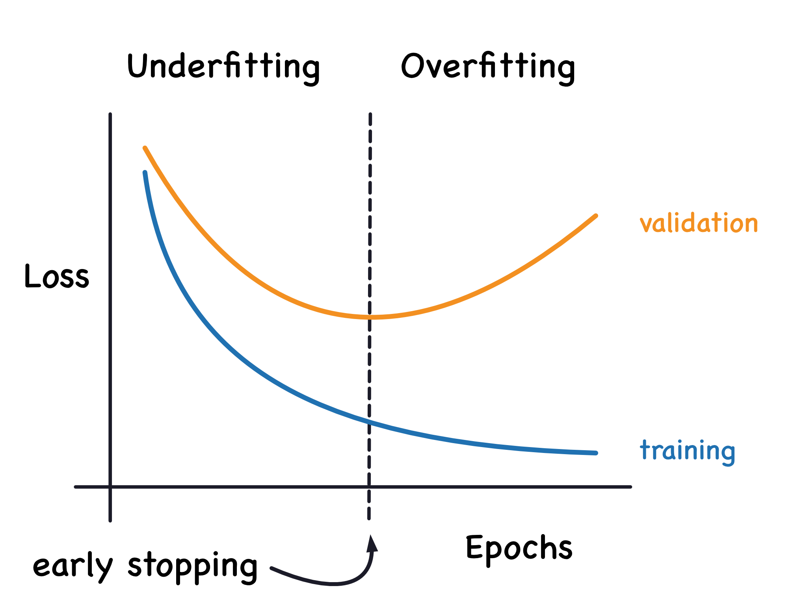
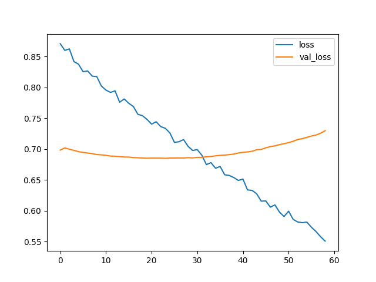
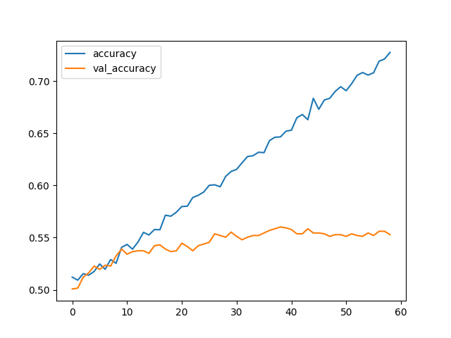

train.py
========

In order to adapt to different models, ``train.py`` is divided into three parts to perform three different model training tasks. train.py is friendly to supercomputer logs. It turns off the display of the progress bar to avoid flooding the screen and log system. At the same time, the picture will not be displayed and will be saved directly to the corresponding location.

.. image:: img/div.png

train_cnn_dense_resnet
++++++++++++++++++++++

Function prototype
------------------

.. code-block:: python

	void train_cnn_dense_resnet(gen_name, model_name)

This function is called by ``DeepChromeHiC.py`` . There are two inputs: the name of the gene to be trained ``gen_name`` and the name of the selected model ``model_name``

This function has no return value.

This function can train the following models:

#. ``onehot_cnn_one_branch``
#. ``onehot_embedding_dense``
#. ``onehot_dense``
#. ``onehot_resnet18``
#. ``onehot_resnet34``

The model used by this function does ``not`` require ``dna2vec embedding``, and the data is ``merged before entering the model``.

ImageDataGenerator
------------------

In order to reduce the problem of storage space consumption, this model uses ``png`` images as input, and png uses Huffman coding compression, which greatly reduces the volume of data. Because the CPU speed is faster than the disk, it will not consume too much time to decode after being compressed into png format, and it is faster than reading the original data under the actual test.

ImageDataGenerator has completed data shuffling.

.. code-block:: python

	from keras.preprocessing.image import ImageDataGenerator

	train_datagen = ImageDataGenerator(rescale = 1./255, validation_split = 0.11) # set validation split

    BATCH_SIZE = 32

    train_generator = train_datagen.flow_from_directory(directory = 'data/'+gen_name+'/png_train/',
                                                        target_size = (20002, 5),
                                                        color_mode = 'grayscale',
                                                        class_mode = 'categorical',
                                                        batch_size = BATCH_SIZE,
                                                        subset = 'training',  # set as training data
                                                        shuffle = True, # shuffle
                                                        seed = 42,
                                                        )
    val_generator = train_datagen.flow_from_directory(directory = 'data/'+gen_name+'/png_train/', # same directory as training data
                                                      target_size = (20002, 5),
                                                      color_mode = 'grayscale',
                                                      class_mode = 'categorical',
                                                      batch_size = BATCH_SIZE,
                                                      subset = 'validation', # set as validation data
                                                      shuffle = True, # shuffle
                                                      seed = 42,
                                                      )

EarlyStopping
-------------

In order to avoid ``over-fitting`` problems, EarlyStopping is adopted, which can end the training process before over-fitting occurs.

The tolerance is set to ``10`` epoches, and the ``best weights`` will be saved. This is the optimal parameter after testing.

.. code-block:: python

	from keras.callbacks import EarlyStopping

	early_stopping = EarlyStopping(monitor = 'val_accuracy', patience = 10, restore_best_weights = True)

PlotProgress
------------

In order to show the situation during the training process more clearly, I wrote a function to show the loss and accuracy during the training process. They include training set loss, validation set loss, training set accuracy, and validation set accuracy.

The display is shown in the figure above, and the source code is below.

.. code-block:: python
	
	# Call Class
	plot_progress = PlotProgress(entity = ['loss', 'accuracy'])
	
	# Class Prototype
	class PlotProgress(keras.callbacks.Callback):

        def __init__(self, entity = ['loss', 'accuracy']):
            self.entity = entity

        def on_train_begin(self, logs={}):
            self.i = 0
            self.x = []
            self.losses = []
            self.val_losses = []

            self.accs = []
            self.val_accs = []

            self.fig = plt.figure()

            self.logs = []

        def on_epoch_end(self, epoch, logs={}):
            self.logs.append(logs)
            self.x.append(self.i)
            # loss
            self.losses.append(logs.get('{}'.format(self.entity[0])))
            self.val_losses.append(logs.get('val_{}'.format(self.entity[0])))
            # acc
            self.accs.append(logs.get('{}'.format(self.entity[1])))
            self.val_accs.append(logs.get('val_{}'.format(self.entity[1])))

            self.i += 1

            plt.figure(0)
            plt.clf() # clear output
            plt.plot(self.x, self.losses, label="{}".format(self.entity[0]))
            plt.plot(self.x, self.val_losses, label="val_{}".format(self.entity[0]))
            plt.legend()
            plt.savefig('result/'+gen_name+'/'+model_name+'/loss.png')
            # plt.pause(0.01)
            # plt.show() # Supercomputers are completely command lines and cannot display pictures.

            plt.figure(1)
            plt.clf()  # clear output
            plt.plot(self.x, self.accs, label="{}".format(self.entity[1]))
            plt.plot(self.x, self.val_accs, label="val_{}".format(self.entity[1]))
            plt.legend()
            plt.savefig('result/'+gen_name+'/'+model_name+'/acc.png')
            # plt.pause(0.01)
            # plt.show() # Supercomputers are completely command lines and cannot display pictures.

Save Weights
------------

In order to reduce the amount of saved data, a scheme of saving ``weights`` is adopted. The trained model will save the weight to the ``h5_weight`` file directory. When testing the model later, the system will ``automatically`` identify the save path.

.. code-block:: python

	clf.save_weights('h5_weights/'+gen_name+'/'+model_name+'.h5')
    # Print it out for easy inspection
    fancy_print('save_weights', 'h5_weights/'+gen_name+'/'+model_name+'.h5', '=')

.. image:: img/div.png

train_cnn_separate
++++++++++++++++++

Function prototype
------------------

.. code-block:: python

	void train_cnn_separate(gen_name, model_name)

This function is called by ``DeepChromeHiC.py`` . There are two inputs: the name of the gene to be trained ``gen_name`` and the name of the selected model ``model_name``

This function has no return value.

This function can train the following models:

#. ``onehot_cnn_two_branch``

The model used by this function does ``not`` require ``dna2vec embedding``, and the data is ``not merged before entering the model``.

ImageDataGenerator
------------------

In order to reduce the problem of storage space consumption, this model uses ``png`` images as input, and png uses Huffman coding compression, which greatly reduces the volume of data. Because the CPU speed is faster than the disk, it will not consume too much time to decode after being compressed into png format, and it is faster than reading the original data under the actual test.

ImageDataGenerator has completed data shuffling.

.. code-block:: python

	from keras.preprocessing.image import ImageDataGenerator

    train_datagen = ImageDataGenerator(rescale = 1. / 255, validation_split = 0.11)

    BATCH_SIZE = 32

    def generator_two_train():
        train_generator1 = train_datagen.flow_from_directory(directory = 'data/'+gen_name+'/train_en/', target_size = (10001, 5),
                                                             color_mode = 'grayscale',
                                                             class_mode = 'categorical',
                                                             batch_size = BATCH_SIZE,
                                                             subset = 'training', # set as training data
                                                             shuffle = True,
                                                             seed = 42) # Shuffle in the same way
        train_generator2 = train_datagen.flow_from_directory(directory = 'data/'+gen_name+'/train_pr/', target_size = (10001, 5),
                                                             color_mode = 'grayscale',
                                                             class_mode = 'categorical',
                                                             batch_size = BATCH_SIZE,
                                                             subset = 'training', # set as training data
                                                             shuffle = True,
                                                             seed = 42) # Shuffle in the same way
        while True:
            out1 = train_generator1.next()
            out2 = train_generator2.next()
            yield [out1[0], out2[0]], out1[1]  # Return the combination of two and the result

    def generator_two_val():
        val_generator1 = train_datagen.flow_from_directory(directory = 'data/'+gen_name+'/train_en/', target_size = (10001, 5),
                                                           color_mode = 'grayscale',
                                                           class_mode = 'categorical', 
                                                           batch_size = BATCH_SIZE,
                                                           subset = 'validation', # set as validation data
                                                           shuffle =True,
                                                           seed = 42) # Shuffle in the same way
        val_generator2 = train_datagen.flow_from_directory(directory = 'data/'+gen_name+'/train_pr/', target_size = (10001, 5),
                                                           color_mode = 'grayscale',
                                                           class_mode = 'categorical', 
                                                           batch_size = BATCH_SIZE,
                                                           subset = 'validation', # set as validation data
                                                           shuffle = True,
                                                           seed = 42) # Shuffle in the same way
        while True:
            out1 = val_generator1.next()
            out2 = val_generator2.next()
            yield [out1[0], out2[0]], out1[1] # Return the combination of two and the result

EarlyStopping
-------------

In order to avoid ``over-fitting`` problems, EarlyStopping is adopted, which can end the training process before over-fitting occurs.

The tolerance is set to ``10`` epoches, and the ``best weights`` will be saved. This is the optimal parameter after testing.

.. code-block:: python

	from keras.callbacks import EarlyStopping

	early_stopping = EarlyStopping(monitor = 'val_accuracy', patience = 10, restore_best_weights = True)

Save Weights
------------

In order to reduce the amount of saved data, a scheme of saving ``weights`` is adopted. The trained model will save the weight to the ``h5_weight`` file directory. When testing the model later, the system will ``automatically`` identify the save path.

.. code-block:: python

	clf.save_weights('h5_weights/'+gen_name+'/'+model_name+'.h5')
    # Print it out for easy inspection
    fancy_print('save_weights', 'h5_weights/'+gen_name+'/'+model_name+'.h5', '=')
	
	
	
	
	
.. image:: img/div.png

train_embedding
+++++++++++++++

Function prototype
------------------

.. code-block:: python

	void train_embedding(gen_name, model_name)

This function is called by ``DeepChromeHiC.py`` . There are two inputs: the name of the gene to be trained ``gen_name`` and the name of the selected model ``model_name``

This function has no return value.

This function can train the following models:

#. ``embedding_cnn_one_branch``
#. ``embedding_cnn_two_branch``
#. ``embedding_dense``
#. ``onehot_embedding_cnn_one_branch``
#. ``onehot_embedding_cnn_two_branch``

The model used by this function require ``dna2vec embedding``.

EarlyStopping
-------------

In order to avoid ``over-fitting`` problems, EarlyStopping is adopted, which can end the training process before over-fitting occurs.

The tolerance is set to ``20`` epoches, and the ``best weights`` will be saved. This is the optimal parameter after testing.

.. code-block:: python

	from keras.callbacks import EarlyStopping

	early_stopping = EarlyStopping(monitor = 'val_accuracy', patience = 20, restore_best_weights = True)

PlotProgress
------------

In order to show the situation during the training process more clearly, I wrote a function to show the loss and accuracy during the training process. They include training set loss, validation set loss, training set accuracy, and validation set accuracy.

The display is shown in the figure above, and the source code is below.

.. code-block:: python
	
	# Call Class
	plot_progress = PlotProgress(entity = ['loss', 'accuracy'])
	
	# Class Prototype
	class PlotProgress(keras.callbacks.Callback):

        def __init__(self, entity = ['loss', 'accuracy']):
            self.entity = entity

        def on_train_begin(self, logs={}):
            self.i = 0
            self.x = []
            self.losses = []
            self.val_losses = []

            self.accs = []
            self.val_accs = []

            self.fig = plt.figure()

            self.logs = []

        def on_epoch_end(self, epoch, logs={}):
            self.logs.append(logs)
            self.x.append(self.i)
            # loss
            self.losses.append(logs.get('{}'.format(self.entity[0])))
            self.val_losses.append(logs.get('val_{}'.format(self.entity[0])))
            # acc
            self.accs.append(logs.get('{}'.format(self.entity[1])))
            self.val_accs.append(logs.get('val_{}'.format(self.entity[1])))

            self.i += 1

            plt.figure(0)
            plt.clf() # clear output
            plt.plot(self.x, self.losses, label="{}".format(self.entity[0]))
            plt.plot(self.x, self.val_losses, label="val_{}".format(self.entity[0]))
            plt.legend()
            plt.savefig('result/'+gen_name+'/'+model_name+'/loss.png')
            # plt.pause(0.01)
            # plt.show() # Supercomputers are completely command lines and cannot display pictures.

            plt.figure(1)
            plt.clf()  # clear output
            plt.plot(self.x, self.accs, label="{}".format(self.entity[1]))
            plt.plot(self.x, self.val_accs, label="val_{}".format(self.entity[1]))
            plt.legend()
            plt.savefig('result/'+gen_name+'/'+model_name+'/acc.png')
            # plt.pause(0.01)
            # plt.show() # Supercomputers are completely command lines and cannot display pictures.

Save Weights
------------

In order to reduce the amount of saved data, a scheme of saving ``weights`` is adopted. The trained model will save the weight to the ``h5_weight`` file directory. When testing the model later, the system will ``automatically`` identify the save path.

.. code-block:: python

	clf.save_weights('h5_weights/'+gen_name+'/'+model_name+'.h5')
    # Print it out for easy inspection
    fancy_print('save_weights', 'h5_weights/'+gen_name+'/'+model_name+'.h5', '=')	
	
	
	
	
	
.. image:: img/div.png